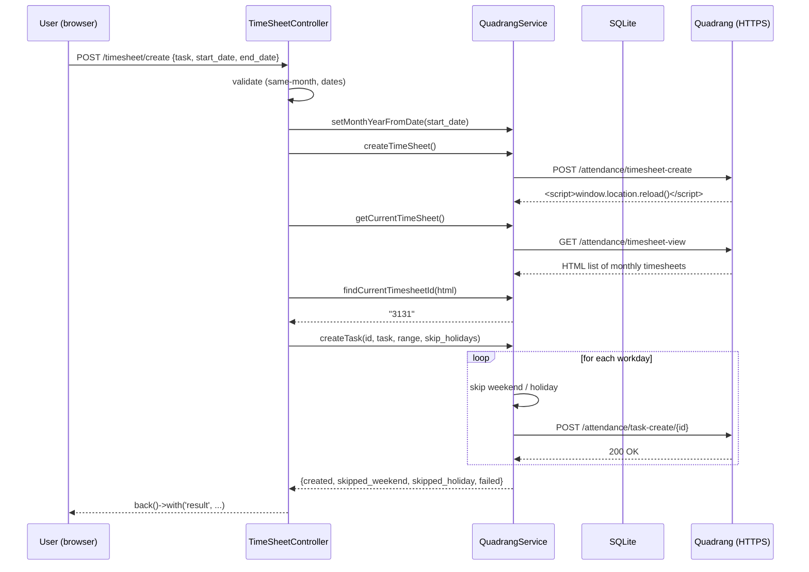
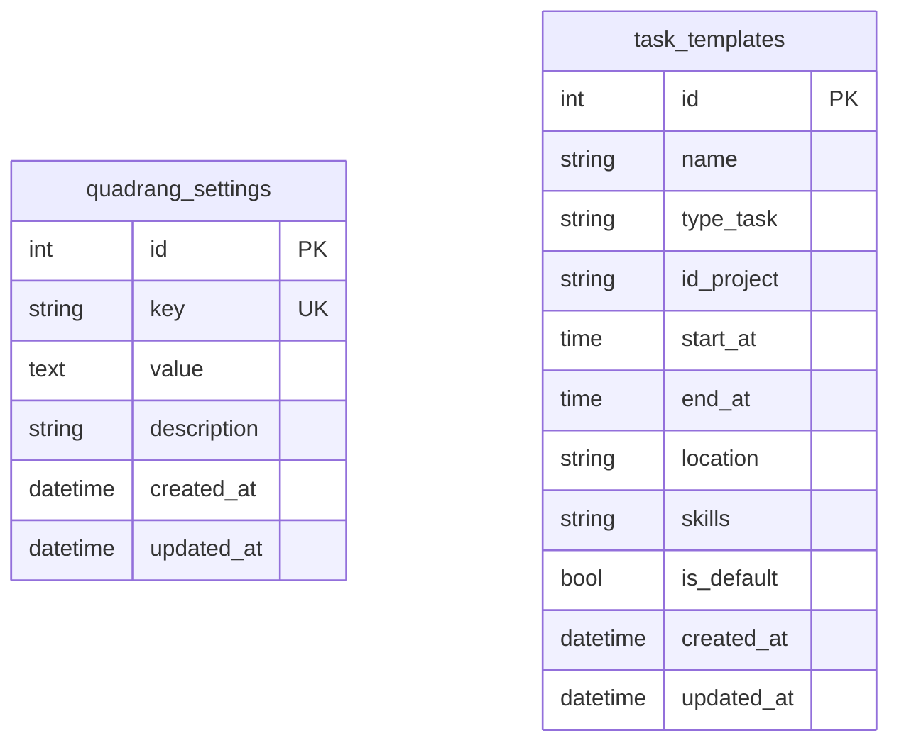

# Quadrang Timesheet Helper

A small Laravel 12 app that automates daily timesheet entry on
[Quadrang](https://quadrang.steradian.co.id) — the internal attendance
system at Steradian. Pick a date range, the app posts one task per
workday (skipping weekends and Indonesian public holidays) using your
existing Quadrang session cookie.

Built as a personal tool, no authentication layer; configuration lives
in SQLite and is editable from the browser.

---

## Features

- **Range picker with live calendar preview** — weekdays, weekends,
  Indonesian public holidays are all color-coded before you submit.
- **Per-day task creation** — submits one POST per workday within the
  selected range, with retry and SSL-safe HTTP settings so a slow
  Quadrang server or one transient network blip will not abort the
  batch.
- **Holiday-aware** — pulls public holidays from
  [libur.deno.dev](https://libur.deno.dev) and skips them when the
  *Skip public holiday* toggle is on.
- **Cookie & CSRF refresh from the browser** — when Quadrang logs you
  out, paste a fresh `Cookie` and `X-CSRFToken` from DevTools into
  `/settings`. No `php artisan config:clear` round trip.
- **Reusable task templates** — project id, working hours, location,
  skills, task type, all editable from the UI; one row flagged as
  default.
- **Web form + JSON API** — both `POST /timesheet/create` (HTML, with
  flash message and SweetAlert2 result modal) and
  `POST /api/timesheet/create` (JSON) share the same business logic.

## Tech stack

- **Laravel 12.25** on PHP 8.2
- **SQLite** for runtime config and task templates
- **Bootstrap 5** + vanilla JS + SweetAlert2 in the browser (loaded
  from CDN; no Node build step required)
- **Carbon** for date math, `Illuminate\Http\Client` (Guzzle) for the
  Quadrang API calls

## Quick start

```bash
git clone https://github.com/muhammadiwa/quad.git
cd quad

composer install
cp .env.example .env
php artisan key:generate

# create the SQLite database file (gitignored) and run migrations
php artisan migrate --force
php artisan db:seed              # also runs QuadrangSeeder

php artisan serve                # http://127.0.0.1:8000
```

## First-time configuration

1. Open `https://quadrang.steradian.co.id` in Chrome and log in.
2. Open DevTools → **Application** → **Cookies** →
   `https://quadrang.steradian.co.id`. Copy the value of `csrftoken`
   and `sessionid`.
3. Open DevTools → **Network** → click any request Quadrang made →
   copy the full `Cookie` request header.
4. From the same Network panel, copy the `X-CSRFToken` request header.
5. Open the app at `http://127.0.0.1:8000`, click **⚙ Settings** in
   the top-right, paste `csrf_token` and `cookie` into the form, save.
6. Back on `/timesheet`, pick a one-month range, preview the calendar,
   click **Jalankan Create Timesheet**.

After that, every time Quadrang logs you out, repeat step 2–5.

## Usage

| Route | Method | Purpose |
| --- | --- | --- |
| `/` | GET | Redirects to `/timesheet` |
| `/timesheet` | GET | Calendar form (default landing page) |
| `/timesheet/create` | POST | Web form submission, returns flash message |
| `/api/timesheet/create` | POST | JSON API, same flow, JSON response |
| `/timesheet/holidays` | GET | JSON list of Indonesian holidays for a year/month |
| `/settings` | GET / PATCH | Edit `base_url`, `csrf_token`, `cookie`, default template |
| `/settings/template/new` | GET | New task template form |
| `/settings/template/{id}` | GET / PUT / DELETE | Edit / update / delete a template |

### Programmatic usage

```bash
curl -X POST http://127.0.0.1:8000/api/timesheet/create \
  -H 'Content-Type: application/json' \
  -d '{
    "task": "Migrasi ESB ke Brigate",
    "start_date": "2026-06-01",
    "end_date":   "2026-06-30",
    "skip_holidays": true
  }'
```

Successful response:

```json
{
  "success": true,
  "message": "Task created successfully",
  "data": {
    "timesheet_id": "3131",
    "start_date": "2026-06-01",
    "end_date":   "2026-06-30",
    "month": "6",
    "year":  "2026",
    "created":         ["2026-06-01", "2026-06-02", "..."],
    "skipped_weekend": ["2026-06-06", "2026-06-07", "..."],
    "skipped_holiday": [],
    "failed":          []
  }
}
```

## Architecture

```
app/
  Http/Controllers/
    TimeSheetController.php      ← web form + JSON API, shared validator
    SettingsController.php       ← /settings credentials + default pick
    TaskTemplateController.php   ← /settings/template/* CRUD
  Models/
    QuadrangSetting.php          ← key/value cache-backed model
    TaskTemplate.php             ← default-flagged per-task payload
  Services/
    QuadrangService.php          ← all Quadrang HTTP, retry, scrape, loop
config/
  quadrang.php                   ← currently empty (kept for future use)
database/
  migrations/
    ..._create_quadrang_settings_table.php
    ..._create_task_templates_table.php
  seeders/
    QuadrangSeeder.php           ← migrates QUADRANG_* env vars into DB
resources/views/
  timesheet/create.blade.php     ← calendar form + preview JS
  settings/edit.blade.php        ← credentials + template list
  settings/template.blade.php    ← create/edit template form
routes/web.php
```

### Request flow



### Database schema



`quadrang_settings` is intentionally a flat key/value store: it is
read on every Quadrang HTTP request, so the model caches the whole
table in `Cache::rememberForever('quadrang_settings', ...)` and busts
the cache on `saved`/`deleted`.

`task_templates.is_default` is enforced unique by two layers:

1. `TaskTemplate::saving` hook: when a row is saved with
   `is_default = true`, mass-update every other row to `false`.
2. `SettingsController::update` always uses `$model->update([...])`
   (Eloquent), never `Model::where()->update()` (query builder), so
   model events fire.

## Configuration

| DB key | Default | Purpose |
| --- | --- | --- |
| `base_url` | `https://quadrang.steradian.co.id` | Quadrang site base URL |
| `csrf_token` | `""` | `X-CSRFToken` request header |
| `cookie` | `""` | Full `Cookie` request header |
| `default_task_description` | `Migrasi ESB ke Brigate dan SOAP ke REST API` | Prefilled in the form |
| `user_agent` | Chrome on Windows | Browser-like UA for Quadrang |

All five are seeded from the matching `QUADRANG_*` env vars on first
migration. After that, edit them from `/settings` — env vars become
optional.

## Known limitations & roadmap

- **Sequential per-day POST loop.** A full month takes ~20–30 seconds
  synchronously; the route sets `set_time_limit(300)`. A queued job
  with progress polling would unblock the UI and let multiple months
  be processed in parallel — see the *Roadmap* section below.
- **HTML scrape for timesheet ID.** The `findCurrentTimesheetId()`
  regex targets the rendered `<div class="oh-sticky-table__tr">`
  markup. If Quadrang changes the wrapper class or column order, the
  scrape silently returns `null`. Wrapping the scrape in a dedicated
  `QuadrangPageParser` value object with a feature test would catch
  regressions early.
- **No automated tests.** Only Laravel's stock `ExampleTest`. Unit
  tests for `QuadrangService` with `Http::fake()` would be cheap and
  high-value.
- **Single-user by design.** There is no auth — anyone who can reach
  the host can edit settings and trigger POSTs to Quadrang under your
  cookie. Run it on `localhost` or behind a reverse-proxy with basic
  auth if you need to expose it.

## Troubleshooting

**`Gagal Memproses — Timesheet ID tidak ditemukan dari halaman Quadrang`**

The HTML returned by Quadrang does not contain
`<a href="/attendance/task/(\d+)">` in the row matching the current
month. Usually means the cookie or CSRF token in `/settings` has
expired. Refresh both from the browser DevTools (see *First-time
configuration* above).

**`cURL error 28: SSL connection timeout`**

Quadrang was slow or unreachable. The service already retries 3× with
2s backoff and a 20s total timeout; if you still see this, check your
network or run the request manually:

```bash
php artisan tinker --execute='echo app(App\Services\QuadrangService::class)->getCurrentTimeSheet()->status();'
```

**`Maximum execution time of 30 seconds exceeded`**

Outdated — fixed in commit `e1cb2c1`. `set_time_limit(300)` is set
at the top of `TimeSheetController::store` and `create`, and the
QuadrangService uses 20s request timeout + 3× retry per day.

## Contributing

1. Fork this repository.
2. Create a feature branch: `git checkout -b feat/your-thing`.
3. Make your change. Keep `php artisan test` green if you add tests.
4. Push and open a PR against `ErrLogic/quad:main`.

## License

MIT, same as the underlying Laravel framework.
[opensource.org/licenses/MIT](https://opensource.org/licenses/MIT).
